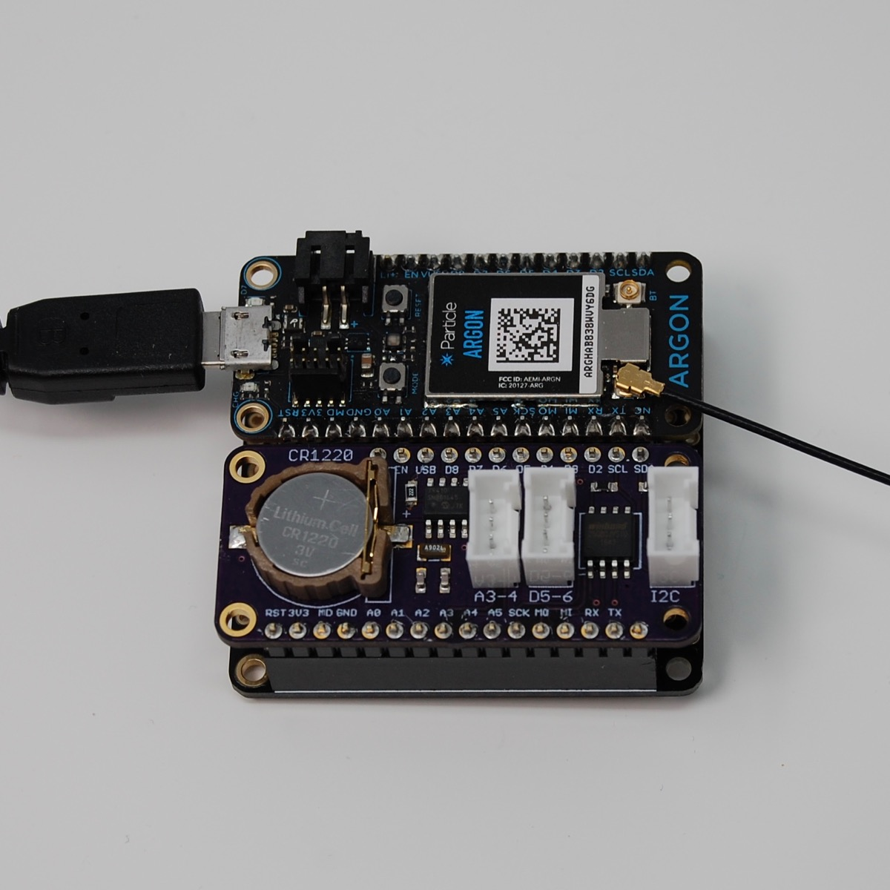
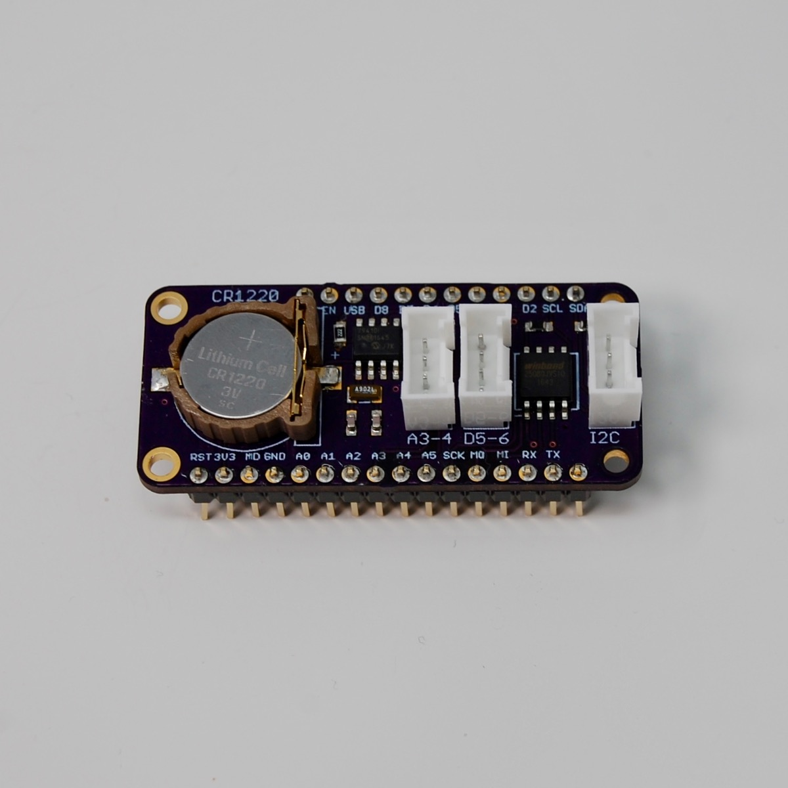
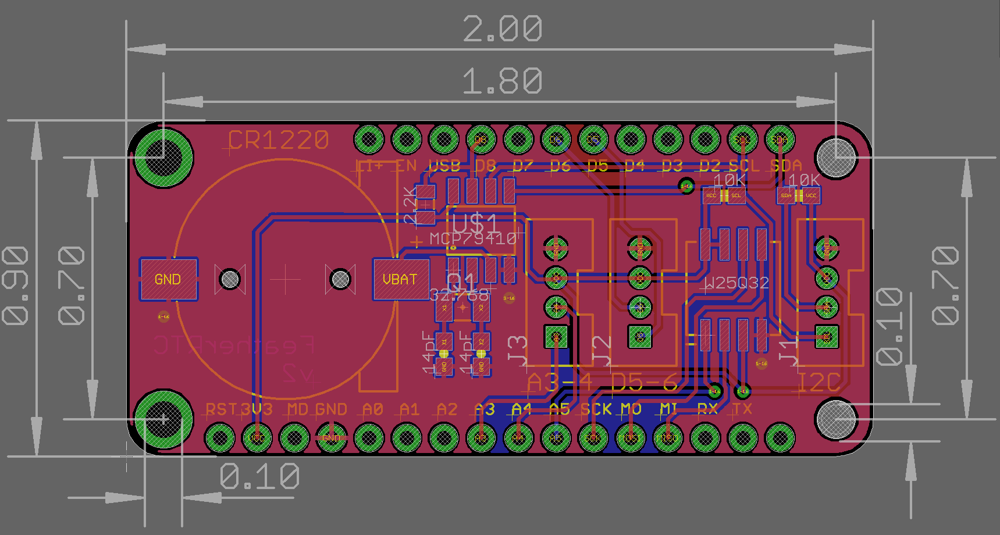
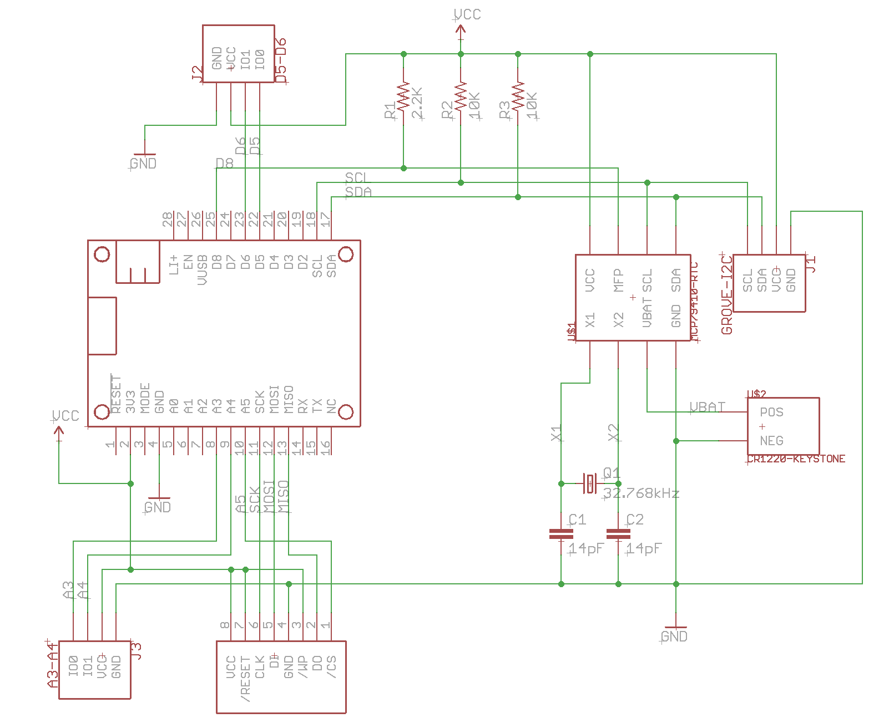

# RTC Flash FeatherWing

*MCP79410 RTC, SPI NOR flash, and Grove connector FeatherWing*



You typically insert this FeatherWing in a [Adafruit FeatherWing Doubler](https://www.adafruit.com/product/2890) or [Tripler](https://www.adafruit.com/product/3417) along with your device. It also works in the Particle Ethernet FeatherWing.

One of the limitations of the Gen 3 (nRF52) hardware is that it cannot wake up from SLEEP\_MODE\_DEEP based on time. That's because the nRF52 real-time-counter does not run in standby sleep mode. Also, when you wake up from SLEEP\_MODE\_DEEP, the Time object is not set until it's synchronized from the cloud again.

My solution to this is a simple Adafruit FeatherWing board with a MCP79410 real-time clock chip. It's inexpensive ($0.93 in single quantities) and tiny. 

Since I had so much room left on the FeatherWing, I also added:

- A CR1220 battery to power the chip with all external power removed (optional)
- 3 Grove expansion connectors (1 digital, 1 analog, 1 I2C, optional)
- A SPI NOR flash memory chip (optional)







## Using RTC to wake from SLEEP\_MODE\_DEEP

Here's a simple program to wake from SLEEP\_MODE\_DEEP:

```
#include "MCP79410RK.h"

SerialLogHandler logHandler;

MCP79410 rtc;

void setup() {
	// Make sure you call rtc.setup() from setup!
	rtc.setup();
}

void loop() {
	// Make sure you call rtc.loop() from loop!
	rtc.loop();


	// Wait 20 seconds after boot to try sleep
	if (millis() > 20000) {
		if (rtc.setAlarm(10)) {
			Log.info("About to SLEEP_MODE_DEEP for 10 seconds");
			System.sleep(SLEEP_MODE_DEEP);
		}
		else {
			Log.info("Failed to setAlarm, not sleeping");
			delay(10000);
		}
	}
}
```

For Gen 2 devices, you might do something like:

```
System.sleep(SLEEP_MODE_DEEP, 10);
```

but using the RTC it would be:

```
if (rtc.setAlarm(10)) {
    System.sleep(SLEEP_MODE_DEEP);
}
```

The reason for the error check around setAlarm is that the alarm can only be set after the RTC has been set to the correct time. Upon cold boot (no 3V3, no battery) the RTC won't be set and sleep cannot be used until the first clock synchronization. This is true even when delaying by seconds.

## Eagle Files

In the eagle directory are:

- FeatherRTC.sch and FeatherRTC.brd, the EagleCAD files
- FeatherRTC.lbr a library containing all of the parts on this board
- FeatherRTC.pdf, the schematic in pdf format

## MCP79410

The [MCP79410](https://github.com/rickkas7/MCP79410RK) library is used for the real-time clock (RTC) chip, and also to access the SRAM and EEPROM features.

There is extensive documentation in that Github for using it. You can find the full browsable API docs [here](http://rickkas7.github.io/MCP79410RK/class_m_c_p79410.html).


## SPI Flash

You can use a variety of SPI NOR flash chips:

- Winbond, such as a [W25Q32](https://www.digikey.com/product-detail/en/winbond-electronics/W25Q32JVSSIQ/W25Q32JVSSIQ-ND/5803981).
- Macronix, such as the [MX25L8006EM1I-12G](https://www.digikey.com/product-detail/en/macronix/MX25L8006EM1I-12G/1092-1117-ND/2744800)
- ISSI, such as a [IS25LQ080B](http://www.digikey.com/product-detail/en/issi-integrated-silicon-solution-inc/IS25LQ080B-JNLE/706-1331-ND/5189766).

The SPI chip select (CS) is connected to pin A5.

I recommend the [SpiFlashRK](https://github.com/rickkas7/SpiFlashRK) to access the flash memory at block level and [SpiffsParticleRK](https://github.com/rickkas7/SpiffsParticleRK) library for using the flash as a file system. 

Using a Winbond flash chip with SpiFlashRK, you'd declare an object like:

```
SpiFlashWinbond spiFlash(SPI, A5);
```

## BOM (Bill of Materials)

| Quantity | Item | Example |
| --- | --- | --- |
| 2 | 14 pf capacitor 0603| [Samsung CL10C140JB8NNNC](https://www.digikey.com/product-detail/en/samsung-electro-mechanics/CL10C140JB8NNNC/1276-2187-1-ND/3890273) |
| 1 | 2.2K resistor 0805 | [Panasonic ERJ-6GEYJ222V](https://www.digikey.com/product-detail/en/panasonic-electronic-components/ERJ-6GEYJ222V/P2.2KACT-ND/93214) |
| 2 | 10K resistor 0603 | [Panasonic ERJ-PA3J103V](https://www.digikey.com/product-detail/en/panasonic-electronic-components/ERJ-PA3J103V/P10KBZCT-ND/5036237)| 
| 1 | 32.768 kHz crystal 9pF | [EPSON FC-135](https://www.digikey.com/product-detail/en/epson/FC-135-32.7680KA-AC0/SER4084CT-ND/6132704) |
| 1 | MCP79410 RTC | [MCP79410-I/SN](https://www.digikey.com/product-detail/en/microchip-technology/MCP79410-I-SN/MCP79410-I-SN-ND/2480419) |
| 1 | SPI NOR flash memory | [Winbond W25Q32JV](https://www.digikey.com/product-detail/en/winbond-electronics/W25Q32JVSSIQ/W25Q32JVSSIQ-ND/5803981) | 
| 3 | Grove connector PTH vertical | [Seeed](https://www.digikey.com/product-detail/en/seeed-technology-co-ltd/110990030/1597-1082-ND/5482560) |
| 1 | CR1220 battery holder | [Keystone 1056TR](https://www.digikey.com/product-detail/en/keystone-electronics/1056/36-1056-ND/2020198) |
| | Male header pins 0.1" | [Sullins PRPC040SAAN-RC](https://www.digikey.com/product-detail/en/PRPC040SAAN-RC/S1011EC-40-ND/2775214) |

